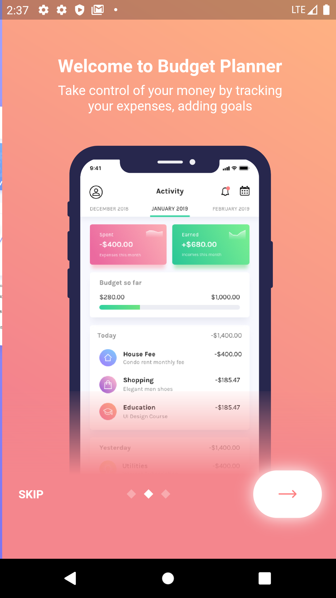
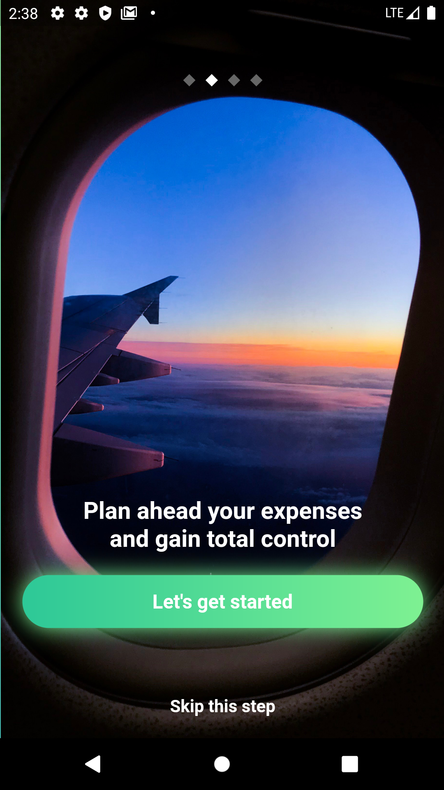
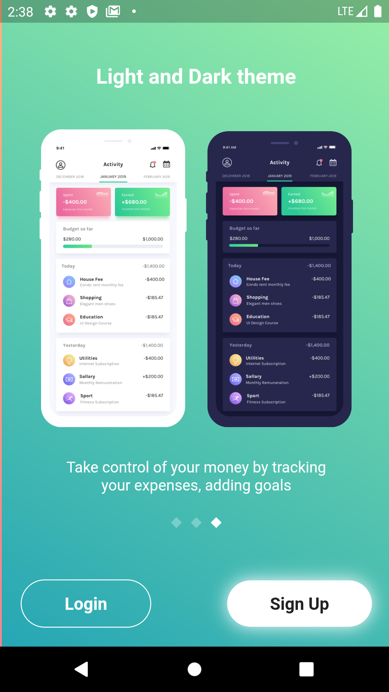
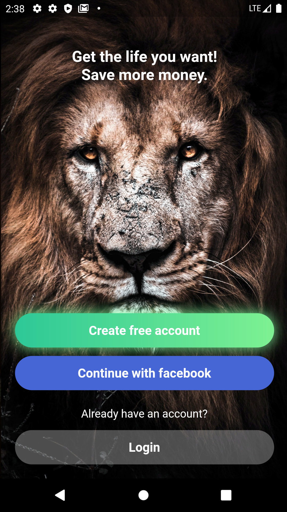
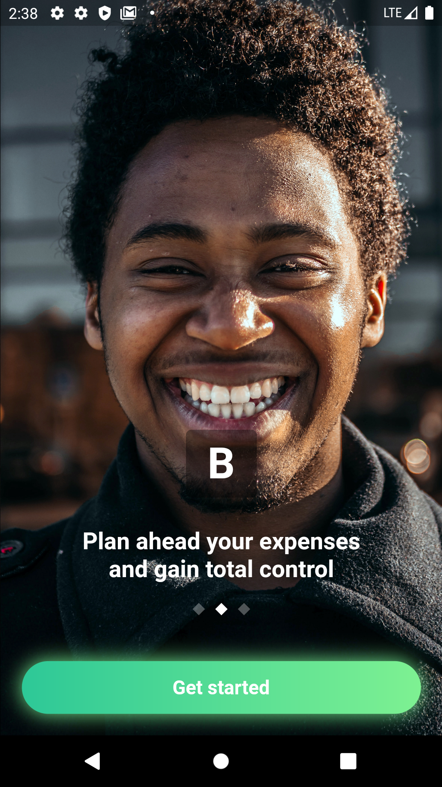

# Flutter Social UIKit
Flutter Budget Planner

## Screenshots

## Security Vulnerabilities

If you discover a security vulnerability within this project, please send an e-mail to Samuel Besemuna Adjei via [besemuna@gmail.com](mailto:besemuna@gmail.com). All security vulnerabilities will be promptly addressed.

## License

This project is open-source software licensed under the [MIT license](https://opensource.org/licenses/MIT).
